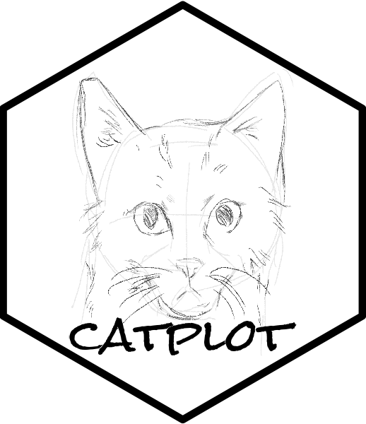

<!-- README.md is generated from README.Rmd. Please edit that file -->

```{r, include = FALSE}
knitr::opts_chunk$set(
  collapse = TRUE,
  comment = "#>",
  fig.path = "man/figures/README-",
  out.width = "60%"
)
```

# catplot: Capable And Tidy Plot 

<!-- badges: start -->
[](http://gitlab.catplot.com/catplot/catplot/-/commits/main)
[](https://lifecycle.r-lib.org/articles/stages.html#experimental)
<!-- badges: end -->

## 🤪 Overview

`catplot` is a capable and tidy data visualization tool and maintained by [Songqi Duan](https://songqi.org).

## 📦 Installation

You can install the development version of `catplot` like so:

``` {r, eval = FALSE}
install.packages("pak")
pak::pak("catplot/catplot")
```

## 🕹️ Usage

This is a basic usage of `catplot`:

```{r example, fig.align='center', fig.dpi=600, fig.width=3, fig.asp=1}
library(ggplot2)
library(catplot)

data("iris")

p <- iris |>
  ggplot(aes(x = Sepal.Length, y = Sepal.Width)) +
  geom_point(aes(color = Species)) +
  theme_cat(aspect_ratio = 1)
p
```

## 🧩 Code of Conduct
  
Please note that the catplot project is released with a [Contributor Code of Conduct](https://catplot.catplot.org/CODE_OF_CONDUCT.html). By contributing to this project, you agree to abide by its terms.
