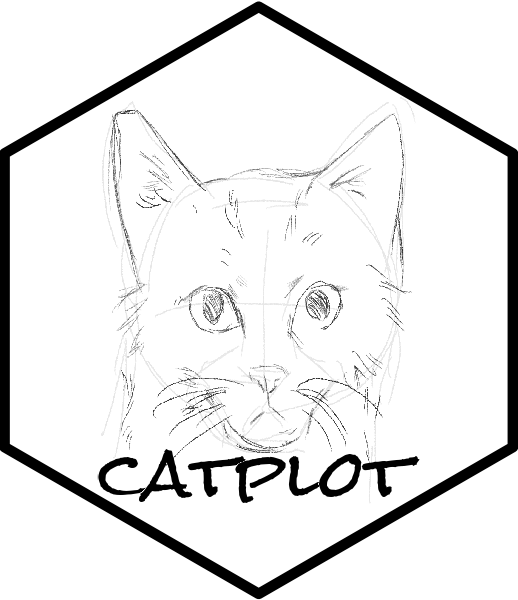
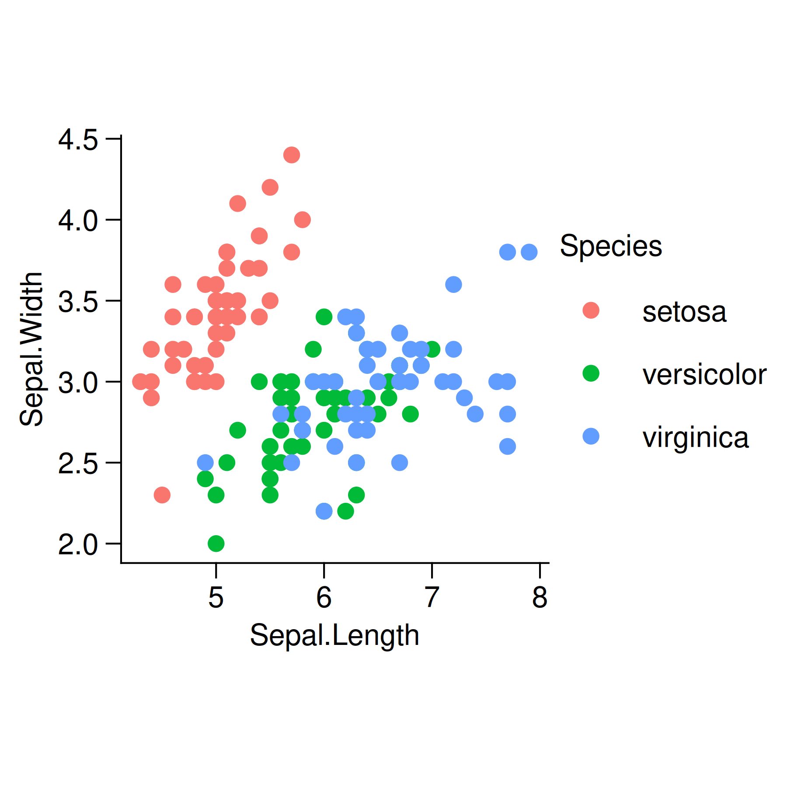

<!-- README.md is generated from README.Rmd. Please edit that file -->

# catplot: Capable And Tidy Plot 

<!-- badges: start -->

[](http://gitlab.catplot.com/catplot/catplot/-/commits/main)
[](https://lifecycle.r-lib.org/articles/stages.html#experimental)
<!-- badges: end -->

## 🤪 Overview

`catplot` is a capable and tidy data visualization tool and maintained
by [Songqi Duan](https://songqi.org).

## 📦 Installation

You can install the development version of `catplot` like so:

``` r
install.packages("pak")
pak::pak("catplot/catplot")
```

## 🕹️ Usage

This is a basic usage of `catplot`:

``` r
library(ggplot2)
library(catplot)

data("iris")

p <- iris |>
  ggplot(aes(x = Sepal.Length, y = Sepal.Width)) +
  geom_point(aes(color = Species)) +
  theme_cat(aspect_ratio = 1)
p
```



## 🧩 Code of Conduct

Please note that the catplot project is released with a [Contributor
Code of Conduct](https://catplot.catplot.org/CODE_OF_CONDUCT.html). By
contributing to this project, you agree to abide by its terms.
